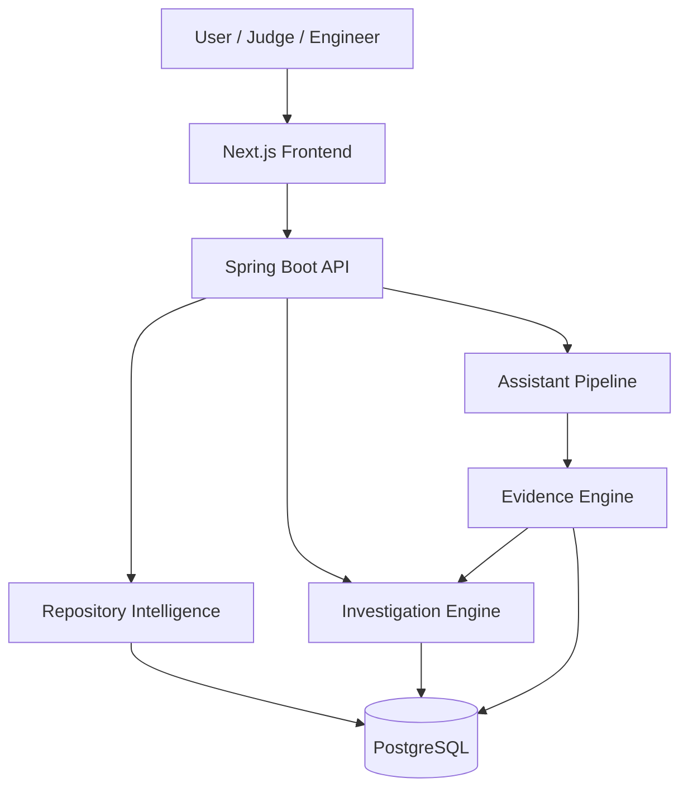

# Git Detective

[](https://github.com/baggashivansh/git-detective/actions/workflows/ci.yml)
[](LICENSE)
[](CHANGELOG.md)
[](backend/pom.xml)
[](backend/pom.xml)
[](frontend/package.json)
[](https://frontend-2a87-3000.prg1.zerops.app)

<p align="center">
  <strong>Git Detective</strong><br/>
  <em>Evidence-backed software investigation for engineering teams</em>
</p>

<p align="center">
  <a href="https://frontend-2a87-3000.prg1.zerops.app"><strong>Live Demo</strong></a>
  ·
  <a href="https://backend-2a87-8080.prg1.zerops.app/health"><strong>API Health</strong></a>
  ·
  <a href="docs/JUDGING_GUIDE.md"><strong>Judging Guide</strong></a>
  ·
  <a href="docs/DEMO_GUIDE.md"><strong>Demo Guide</strong></a>
</p>

---

## Elevator pitch

Git Detective turns a Git repository into a structured **investigation platform**. It indexes repository facts, runs deterministic engineering analysis, packages results as auditable evidence, and optionally explains those facts with an AI assistant that is **not allowed to invent**.

> Git hosts show history. Chatbots invent narratives. Git Detective computes first, then explains — only from evidence.

**Version:** 1.0.0 · **License:** MIT · **Repo:** [baggashivansh/git-detective](https://github.com/baggashivansh/git-detective)

---

## Try it live (Zerops)

| Service | URL |
|---------|-----|
| **Website (frontend)** | [https://frontend-2a87-3000.prg1.zerops.app](https://frontend-2a87-3000.prg1.zerops.app) |
| **API health** | [https://backend-2a87-8080.prg1.zerops.app/health](https://backend-2a87-8080.prg1.zerops.app/health) |
| **OpenAPI / Swagger** | [https://backend-2a87-8080.prg1.zerops.app/swagger-ui.html](https://backend-2a87-8080.prg1.zerops.app/swagger-ui.html) |

**Zerops stack:** `frontend` (Next.js) · `backend` (Spring Boot) · `db` (PostgreSQL 16)

**Quick demo path:** open the live app → **Repositories** → analyze a **public** GitHub URL → open **Investigations** → ask the **Assistant**.

Example public repo to try:

```text
https://github.com/baggashivansh/DSA-Java-Shiv
```

> **Note:** Only **public** GitHub repositories are supported in v1.0. Private repos, GitLab, Bitbucket, and ZIP uploads are not.

---

## Table of contents

1. [Problem](#problem)
2. [Why this stands out](#why-this-stands-out)
3. [How it helps](#how-it-helps)
4. [What it is / is not](#what-it-is--is-not)
5. [Key features](#key-features)
6. [Architecture overview](#architecture-overview)
7. [How it works](#how-it-works)
8. [Technology stack](#technology-stack)
9. [Repository layout](#repository-layout)
10. [Quick start (local)](#quick-start-local)
11. [Environment variables](#environment-variables)
12. [API overview](#api-overview)
13. [Security · Performance · A11y · Observability](#security)
14. [Testing](#testing)
15. [Deployment](#deployment)
16. [Documentation map](#documentation-map)
17. [Roadmap](#roadmap)
18. [Contributing](#contributing)
19. [License](#license)

---

## Problem

When something breaks — or a new engineer joins a codebase — teams ask the same questions:

- Who owns this module?
- What changed recently?
- What is the blast radius of this class?
- How does a request flow through the system?
- Why does this package look risky?

**GitHub** shows raw history — you still assemble the investigation yourself.  
**AI chatbots** give confident answers that may be wrong.

Neither reliably turns repository metadata into **reproducible, auditable engineering conclusions**.

---

## Why this stands out

The problem space is not new. The approach is.

| Approach | Typical tool | Git Detective |
|----------|--------------|---------------|
| Source of truth | Commit messages / LLM memory | Indexed repository metadata |
| Ownership | Heuristic chat answer | Calculated ownership + bus factor |
| Impact | Guessed “related files” | Dependency-graph blast radius |
| AI | Free-form generation | Evidence-bound JSON + validator |
| Auditability | Weak | Every evidence item has provenance + confidence |

**Pipeline (non-negotiable):**

```text
Repo → Intelligence → Investigation → Evidence Engine → Assistant → UI
```

AI is optional and constrained. It never bypasses the Evidence Engine. If evidence is insufficient, the product says so — it does not speculate.

---

## How it helps

| Audience | Value |
|----------|-------|
| New engineers | Onboard with ownership, timeline, and architecture relationships |
| Incident responders | Trace what changed and what else is in the blast radius |
| Tech leads | Spot bus-factor risk and hotspot packages before changes land |
| Judges / reviewers | See a production-style 3-service architecture with clear engineering boundaries |

**One sentence:** Git Detective doesn’t summarize your repo — it investigates it, with evidence.

---

## What it is / is not

### It is
- An evidence-backed **software investigation** platform
- A monorepo with frontend + backend + database on Zerops
- Deterministic analysis first; AI explanation second

### It is not
- A GitHub / GitLab clone
- A generic repository summarizer
- An autonomous coding agent (no commits, PRs, or code edits)
- A private-repo OAuth product (v1.0 = public GitHub + server LOCAL paths only)

---

## Key features

### Repository Intelligence
- Analyze **public GitHub** URLs or **LOCAL** git paths (on the server)
- Async pipeline: clone/copy → JGit metadata → filesystem index → JavaParser → dependency graph
- Browse tree, contributors, languages, commits, packages, classes, search

### Investigation Engine
- Targets: class, method, package, commit, file, contributor, branch, tag
- Timeline, ownership, bus factor, impact / blast radius, relationships
- Package health, hotspots, commit clustering
- Request-flow and auth-flow detection when evidence exists
- Factual reports (JSON / Markdown / HTML)

### Evidence Engine
- Internal bounded context (no public Evidence HTTP API)
- Immutable `EvidenceBundle` with deterministic confidence rules
- Collectors, validator, in-memory cache (Redis-ready interface)

### Investigation Assistant
- Deterministic intent detection (no LLM for classification)
- Context built **only** from `EvidenceEngine`
- `AiProvider` abstraction (OpenAI-compatible + stub mode for offline/CI)
- Citation validation before any answer is returned
- Blocking + SSE streaming chat UI

### Production readiness (v1.0)
- Security headers, CORS allow-list, rate limiting, correlation IDs
- Flyway migrations + production indexes
- Docker Compose, Zerops deploy (`zerops.yml`), CI, Dependabot

---

## Screenshots & demo

> Add captures under `docs/assets/` when available (`landing.png`, `repository.png`, `investigation.png`, `assistant.png`).

| Resource | Link |
|----------|------|
| **Live app** | [frontend-2a87-3000.prg1.zerops.app](https://frontend-2a87-3000.prg1.zerops.app) |
| **Demo walkthrough** | [docs/DEMO_GUIDE.md](docs/DEMO_GUIDE.md) |
| **5-minute judging guide** | [docs/JUDGING_GUIDE.md](docs/JUDGING_GUIDE.md) |
| **Demo video** | _add link when available_ |

---

## Architecture overview



### End-to-end flow

```text
Git Repository
      │
      ▼
Repository Intelligence  →  Knowledge Base (Postgres)
      │
      ▼
Investigation Engine     →  Timeline / Ownership / Impact / …
      │
      ▼
Evidence Engine          →  EvidenceBundle (immutable)
      │
      ▼
Assistant (optional)     →  Validated, cited answer
      │
      ▼
Frontend
```

**Hard rule:** the Assistant never calls Git, JavaParser, investigation engines, or JPA entities for investigative facts. It uses `EvidenceEngine` only.

Deep dives: [SYSTEM_ARCHITECTURE](docs/SYSTEM_ARCHITECTURE.md) · [INVESTIGATION_ENGINE](docs/INVESTIGATION_ENGINE.md) · [EVIDENCE_ENGINE](docs/EVIDENCE_ENGINE.md) · [AI_ASSISTANT](docs/AI_ASSISTANT.md)

---

## How it works

### 1. Repository Intelligence
`POST /repositories/analyze` queues work:

`QUEUED → CLONING → SCANNING → PARSING → INDEXING → COMPLETED | FAILED`

Engines: `WorkspaceManager`, `GitEngine` (JGit), filesystem indexer, `JavaSourceParser`, `DependencyGraphBuilder`. Workspace is cleaned after completion.

### 2. Investigation Engine
Requires repository status `COMPLETED`. Creates an investigation case and persists deterministic slices (timeline, ownership, impact, relationships, hotspots, package health, clusters, traces).

### 3. Evidence Engine
`EvidenceEngine.gather(investigationId)` builds (or caches) an `EvidenceBundle` from completed investigation output — normalized records with provenance and confidence.

### 4. Assistant
Intent → compact evidence context → prompt → `AiProvider` → evidence validator → formatter → chat UI (or SSE stream).

---

## Technology stack

| Layer | Stack |
|-------|--------|
| Backend | Java 21, Spring Boot 3.4, Spring Security, Spring Data JPA, Flyway |
| Git / parse | JGit, JavaParser |
| Database | PostgreSQL 16 |
| Frontend | Next.js 16 (App Router), React 19, TypeScript, Tailwind 4, React Query, React Flow, Framer Motion |
| API docs | springdoc OpenAPI |
| Deploy | Docker Compose, [Zerops](https://zerops.io) |
| Quality | Spotless, Checkstyle, ESLint, GitHub Actions CI |

---

## Repository layout

```text
git-detective/
├── backend/          Spring Boot API + engines
├── frontend/         Next.js application
├── docs/             Architecture, guides, diagrams
├── docker/           Dockerfiles + Compose
├── scripts/          dev-up / dev-down / format
├── postman/          Phase 1–4 API collections
├── .github/          CI, templates, Dependabot
├── zerops.yml        Zerops build/run descriptors
└── zerops-frontend-import.yml
```

Full tree: [docs/FOLDER_STRUCTURE.md](docs/FOLDER_STRUCTURE.md)

---

## Quick start (local)

### Prerequisites

- Java 21+
- Maven 3.9+
- Node.js 22+
- Docker (for Postgres / full stack)

### 1. Environment

```bash
cp .env.example .env
cp frontend/.env.example frontend/.env.local
```

### 2. Database

```bash
./scripts/dev-up.sh
```

### 3. Backend

```bash
cd backend
mvn spring-boot:run -Dspring-boot.run.profiles=dev
```

- Health: http://localhost:8080/health  
- OpenAPI UI: http://localhost:8080/swagger-ui.html  

### 4. Frontend

```bash
cd frontend
npm install
npm run dev
```

- App: http://localhost:3000  

### Docker full stack

```bash
docker compose -f docker/docker-compose.yml --env-file .env up --build
```

Leave `AI_STUB_MODE=true` for offline demos. For a live OpenAI-compatible provider:

```bash
AI_STUB_MODE=false
AI_API_KEY=sk-...
```

More: [docs/DEVELOPMENT_GUIDE.md](docs/DEVELOPMENT_GUIDE.md)

---

## Environment variables

| Variable | Purpose | Default |
|----------|---------|---------|
| `DATABASE_URL` | JDBC URL | `jdbc:postgresql://localhost:5432/gitdetective` |
| `DATABASE_USERNAME` / `PASSWORD` | DB credentials | `gitdetective` |
| `APP_VERSION` | Reported app version | `1.0.0` |
| `CORS_ALLOWED_ORIGINS` | Browser origins | `http://localhost:3000` |
| `WORKSPACE_ROOT` | Ephemeral clone workspace | temp dir |
| `CLONE_TIMEOUT_SECONDS` | Clone timeout | `300` |
| `MAX_REPOSITORY_SIZE_BYTES` | Size cap | `524288000` |
| `MAX_FILES` / `MAX_COMMITS` | Index caps | `50000` / `10000` |
| `RATE_LIMIT_MAX_REQUESTS` | POST rate limit | `60` |
| `RATE_LIMIT_WINDOW_SECONDS` | Window | `60` |
| `AI_STUB_MODE` | Deterministic offline AI | `true` |
| `AI_API_KEY` | Provider key | empty |
| `AI_BASE_URL` / `AI_MODEL` | Provider endpoint | OpenAI-compatible defaults |
| `NEXT_PUBLIC_API_BASE_URL` | Frontend → API (**build-time**) | `http://localhost:8080` |

Complete list: [`.env.example`](.env.example)

> On Zerops, `NEXT_PUBLIC_API_BASE_URL` must be set **before the frontend build** (it is baked into the client bundle).

---

## API overview

| Area | Base | Notes |
|------|------|-------|
| Health | `GET /health` | App envelope with version |
| Repositories | `/repositories` | Analyze + browse + search |
| Investigations | `/investigations` | Create + slices + report |
| Assistant | `/assistant/conversations` | Chat, SSE stream, export |
| OpenAPI | `/api-docs`, `/swagger-ui.html` | Interactive docs |
| Actuator | `/actuator/health`, `/actuator/metrics` | Ops |

Full reference: [docs/API.md](docs/API.md) · Postman collections in `postman/`

### Minimal happy path

```bash
# Live API (or use http://localhost:8080 locally)
API=https://backend-2a87-8080.prg1.zerops.app

curl -X POST "$API/repositories/analyze" \
  -H 'Content-Type: application/json' \
  -d '{"sourceType":"GITHUB","source":"https://github.com/baggashivansh/DSA-Java-Shiv"}'

# Wait until GET /repositories/{id} → status COMPLETED

curl -X POST "$API/investigations" \
  -H 'Content-Type: application/json' \
  -d '{"repositoryId":"<uuid>","targetType":"FILE","targetRef":"README.md"}'
```

Supported analysis sources: **GITHUB** (public `github.com` URL), **LOCAL** (absolute server path).

---

## Security

- Stateless API; CSRF disabled for JSON clients (no cookie session auth in v1.0)
- Security headers: nosniff, frame deny, referrer policy, permissions policy, HSTS
- CORS allow-list; exposes `X-Correlation-Id` and `Retry-After`
- Rate limiting on expensive POST routes
- Prompt sanitization + evidence citation validation for the assistant
- Secrets via environment variables only

Details: [docs/SECURITY.md](docs/SECURITY.md) · [SECURITY.md](SECURITY.md)

---

## Performance

- Async repository analysis with ephemeral workspaces cleaned after completion
- Analysis caps (`MAX_FILES`, `MAX_COMMITS`, size/timeout limits)
- Evidence Bundle in-memory cache (`EvidenceBundleCache`; Redis-ready interface)
- Flyway `V4` production indexes on hot lookup paths
- Rate limiting on expensive POST routes

---

## Accessibility

- Skip links to main content
- ARIA on interactive controls in investigation / chat surfaces
- `prefers-reduced-motion` support for Framer Motion-driven UI
- Keyboard-usable navigation shell and footer attribution

---

## Logging & observability

- Request correlation via `X-Correlation-Id` (accepted on request, echoed on response, MDC-bound)
- Structured request logging filter
- Actuator: `health`, `info`, `metrics`
- Application health envelope: `GET /health` includes name and version

---

## Testing

```bash
# Backend
cd backend && mvn spotless:check checkstyle:check verify

# Frontend
cd frontend && npm run lint && npm run build
```

CI runs the same gates on `main`. Strategy: [docs/TESTING.md](docs/TESTING.md)

---

## Deployment

### Live (Zerops Challenge)

| Service | Public URL |
|---------|------------|
| Frontend | https://frontend-2a87-3000.prg1.zerops.app |
| Backend | https://backend-2a87-8080.prg1.zerops.app |
| Database | PostgreSQL 16 (`db`) — private network only |

Config: root [`zerops.yml`](zerops.yml)  
Guide: [docs/DEPLOYMENT.md](docs/DEPLOYMENT.md)

### Local / Docker

```bash
docker compose -f docker/docker-compose.yml --env-file .env up --build
```

Production profile: `SPRING_PROFILES_ACTIVE=prod`

Important production env:

```text
DATABASE_URL=jdbc:postgresql://db:5432/db
CORS_ALLOWED_ORIGINS=https://frontend-2a87-3000.prg1.zerops.app
NEXT_PUBLIC_API_BASE_URL=https://backend-2a87-8080.prg1.zerops.app
AI_STUB_MODE=true
```

---

## Documentation map

| Document | Audience |
|----------|----------|
| [docs/JUDGING_GUIDE.md](docs/JUDGING_GUIDE.md) | Hackathon judges (5 minutes) |
| [docs/DEMO_GUIDE.md](docs/DEMO_GUIDE.md) | Live demo script |
| [docs/SYSTEM_ARCHITECTURE.md](docs/SYSTEM_ARCHITECTURE.md) | System view |
| [docs/ARCHITECTURE.md](docs/ARCHITECTURE.md) | Detailed architecture |
| [docs/INVESTIGATION_ENGINE.md](docs/INVESTIGATION_ENGINE.md) | Investigation Engine |
| [docs/EVIDENCE_ENGINE.md](docs/EVIDENCE_ENGINE.md) | Evidence Engine |
| [docs/AI_ASSISTANT.md](docs/AI_ASSISTANT.md) | Assistant pipeline |
| [docs/API.md](docs/API.md) | HTTP API reference |
| [docs/DEPLOYMENT.md](docs/DEPLOYMENT.md) | Deploy |
| [docs/TROUBLESHOOTING.md](docs/TROUBLESHOOTING.md) | Common failures |
| [docs/PROJECT_VISION.md](docs/PROJECT_VISION.md) | Product principles |
| [CHANGELOG.md](CHANGELOG.md) / [RELEASE_NOTES.md](RELEASE_NOTES.md) | Releases |

---

## Roadmap

Post-1.0 candidates (not implemented):

- End-user authentication and authorization
- Distributed (Redis) rate limiting and evidence cache
- Private repository support with credential vaulting
- Broader language parsers beyond Java structural analysis
- PDF binary export (HTML template already exists)

---

## Contributing

See [CONTRIBUTING.md](CONTRIBUTING.md) and [CODE_OF_CONDUCT.md](CODE_OF_CONDUCT.md).

```bash
./scripts/format.sh
```

---

## License

[MIT](LICENSE) © 2026 Shivansh Bagga

---

**Made with ❤️ by Shivansh Bagga**
