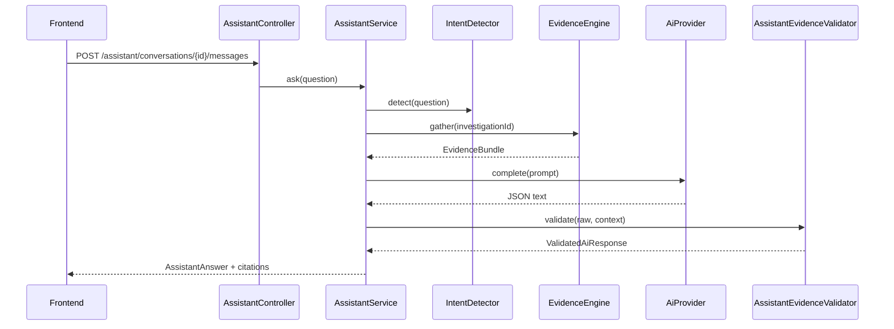

# AI Assistant

## Purpose

Phase **4** adds an evidence-backed investigation assistant.

The assistant explains, summarizes, and simplifies repository facts. It never invents. It never bypasses the Evidence Engine.

## Architecture

```text
User
  ↓
Assistant API (/assistant)
  ↓
Intent Detection          (deterministic, no LLM)
  ↓
Context Builder           (EvidenceBundle only)
  ↓
Evidence Engine
  ↓
Prompt Builder
  ↓
AI Provider               (AiProvider interface)
  ↓
Evidence Validator
  ↓
Response Formatter
  ↓
Frontend (chat / SSE)
```

### Hard boundaries

The assistant must **not** call:

- Git / JGit
- Workspace / clone APIs
- JavaParser
- Investigation engines (timeline, ownership, impact, …) directly
- JPA entities for investigative facts

The only investigative data source is `EvidenceEngine`.

Conversation memory tables (`assistant_conversations`, `assistant_messages`) store chat history only.

## Conversation flow



## Intent detection

`IntentDetector` classifies questions without an LLM:

`SUMMARY`, `OWNERSHIP`, `TIMELINE`, `IMPACT`, `RELATIONSHIP`, `ARCHITECTURE`, `AUTHENTICATION`, `REQUEST_FLOW`, `PACKAGE_HEALTH`, `HOTSPOT`, `STATISTICS`, `GENERAL_INVESTIGATION`, `UNKNOWN`

Unsupported intents (code generation, commits, PRs, fixes) are rejected with `UNSUPPORTED_QUESTION`.

## Provider architecture

```java
public interface AiProvider {
  String complete(PromptPayload prompt);
  void stream(PromptPayload prompt, Consumer<String> onToken, Consumer<String> onComplete);
  String name();
}
```

Implementation: `OpenAiCompatibleAiProvider`

- Calls OpenAI-compatible `/chat/completions`
- When `gitdetective.ai.stub-mode=true` or API key is blank → deterministic evidence-backed JSON (local/CI)
- Application code depends only on `AiProvider`

## Prompt pipeline

`PromptBuilder` produces system, developer, evidence, and user sections. System/developer prompts are never returned to clients. Injection patterns are filtered.

Expected model JSON keys: `answer`, `evidenceIds`, `confidence`, `referencedFiles`, `referencedCommits`, `referencedContributors`, `referencedPackages`.

## Validation

`AssistantEvidenceValidator` rejects unknown evidence IDs, invalid confidence, and unsupported artifact references. Insufficient-evidence answers must state:

> The available repository evidence is insufficient to answer this confidently.

## Response contract

Every answer includes: answer text, evidence used (citations), confidence, supporting artifacts, referenced entities, deterministic follow-up suggestions, intent, insufficient flag.

## Streaming

- `POST /assistant/conversations/{id}/messages/stream` → SSE
- Events: `intent`, `token`, `answer`, `done`, `error`, `cancelled`
- `POST .../cancel` cancels an in-flight stream

## Configuration

```yaml
gitdetective.ai:
  stub-mode: true
  base-url: https://api.openai.com/v1
  api-key: ${AI_API_KEY:}
  model: gpt-4o-mini
```

## Explicit non-goals

No code editing, automatic fixes, Git commits, PRs, issue creation, repository writes, or autonomous agent execution.

---

**Made with ❤️ by Shivansh Bagga**
