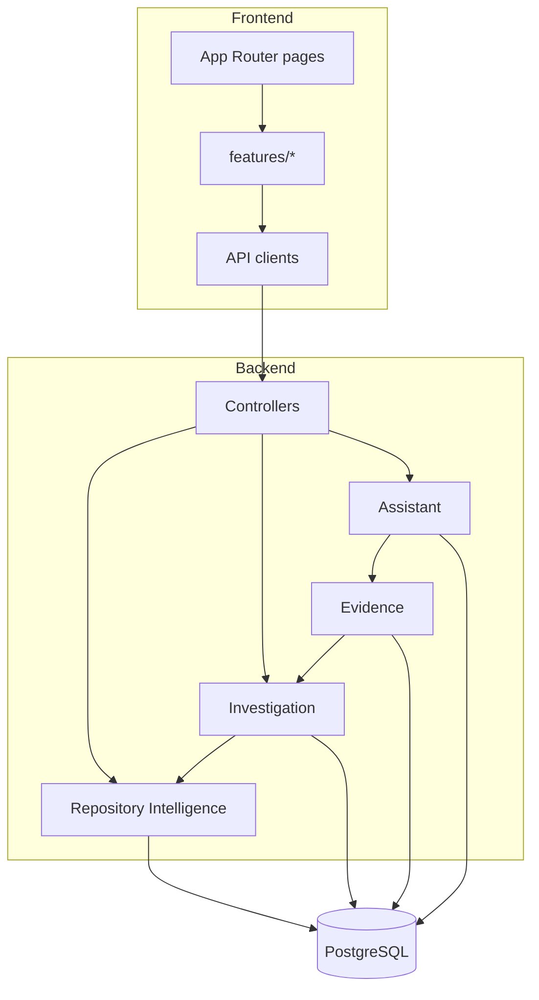

# Architecture

## Overview

Git Detective is a production monorepo with clear separation between presentation, application services, domain engines, and persistence.



## Repository Intelligence pipeline

1. `POST /repositories/analyze` validates source (`GITHUB` | `LOCAL`) and queues work
2. Async worker creates an ephemeral workspace under `WORKSPACE_ROOT`
3. `GitEngine` clones (public GitHub) or copies (LOCAL) and collects branches, tags, commits, contributors (JGit)
4. Filesystem indexer scans the tree (read-only)
5. `JavaSourceParser` extracts Java structural metadata
6. `DependencyGraphBuilder` persists import / inheritance / implementation edges
7. Workspace is deleted after `COMPLETED` or `FAILED`

Progress: `QUEUED → CLONING → SCANNING → PARSING → INDEXING → COMPLETED | FAILED`

## Investigation pipeline

1. `POST /investigations` requires repository `COMPLETED`
2. Target resolved (`InvestigationTargetResolver`)
3. Engines run against indexed metadata only
4. Artifacts persisted under `investigation_*` tables
5. Clients fetch full detail or slice endpoints / report export

## Evidence pipeline

1. `EvidenceEngine.gather(investigationId)` loads completed investigation detail
2. Collectors normalize slices into `EvidenceRecord`s
3. Validator deduplicates, checks provenance confidence, marks `VERIFIED`
4. Immutable `EvidenceBundle` cached in-process (`EvidenceBundleCache`)

No public Evidence REST API.

## Assistant pipeline

```text
Question → IntentDetector → EvidenceEngine → EvidenceContextBuilder
        → PromptBuilder → AiProvider → AssistantEvidenceValidator
        → AssistantResponseFormatter → Response / SSE
```

See [AI_ASSISTANT.md](AI_ASSISTANT.md).

## Data model (Flyway)

| Migration | Purpose |
|-----------|---------|
| `V1__phase2_repository_intelligence.sql` | Repositories, commits, files, types, methods, dependency graph, stats |
| `V2__phase3_investigation_engine.sql` | Investigations + evidence/timeline/ownership/impact/relationships/hotspots/health/clusters/traces |
| `V3__phase4_assistant.sql` | `assistant_conversations`, `assistant_messages` |
| `V4__phase5_production_indexes.sql` | Production indexes (no new tables) |

Exact V2 table names use the `investigation_` prefix (e.g. `investigation_timeline_events`, `investigation_relationships`).

## Backend packages (implemented)

| Package | Role |
|---------|------|
| `controller` | HTTP |
| `analyzer` / `git` / `workspace` / `indexer` / `parser` / `graph` | Repository intelligence |
| `investigation` + domain engines | Investigation |
| `evidence` | Evidence Engine |
| `assistant` | Assistant |
| `entity` / `repository` | JPA |
| `security` / `logging` / `config` | Cross-cutting |

`util` and `validation` are reserved empty packages. `evidence.controller` is intentionally empty.

## Frontend structure

| Route | Purpose |
|-------|---------|
| `/` | Landing |
| `/dashboard` | Workspace overview |
| `/repositories`, `/repositories/[id]` | Analyze + intelligence dashboard |
| `/investigations`, `/investigations/[id]` | Investigation dashboard (includes Assistant tab) |
| `/assistant` | Assistant entry (`?investigationId=` recommended) |

## Security posture

- Permit-all API (no end-user auth in v1.0)
- Security headers + CORS allow-list
- Rate limiting on expensive POST routes
- Correlation IDs on every request

## Explicit non-goals (v1.0)

No repository mutation, no agentic write workflows, no private-repo OAuth, no PDF binary generation (HTML template only).

---

**Made with ❤️ by Shivansh Bagga**
