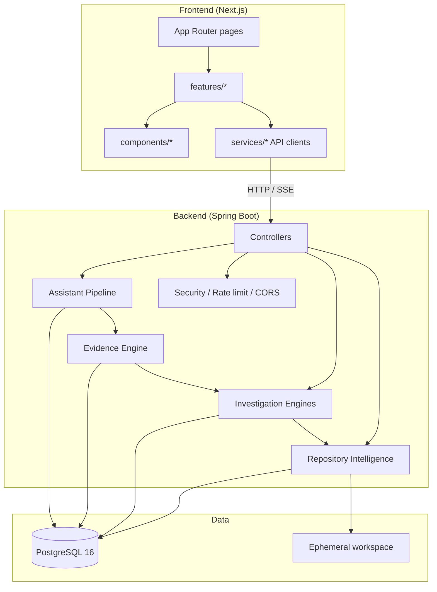

# Component Diagram

Git Detective **v1.0.0** — runtime components and dependency direction.



## Frontend modules

| Area | Path |
|------|------|
| Repositories | `features/repository`, `components/repository` |
| Investigations | `features/investigation`, `components/investigation` |
| Assistant | `features/assistant`, `components/chat`, `components/messages`, `components/evidence` |
| Layout | `components/layout` (shell, sidebar, footer, theme) |
| Landing | `components/landing` |

## Backend modules

| Area | Package root |
|------|--------------|
| HTTP | `controller` |
| Repository Intelligence | `analyzer`, `git`, `workspace`, `indexer`, `parser`, `graph` |
| Investigation | `investigation`, `timeline`, `ownership`, `impact`, `relationship`, `history`, `trace` |
| Evidence | `evidence` |
| Assistant | `assistant` |
| Persistence | `entity`, `repository`, Flyway `db/migration` |
| Cross-cutting | `security`, `logging`, `config`, `exception` |

## Dependency rule

```text
Assistant → Evidence → Investigation → Repository Intelligence → PostgreSQL / Git
```

Never reverse this chain for investigative facts.

---

**Made with ❤️ by Shivansh Bagga**
