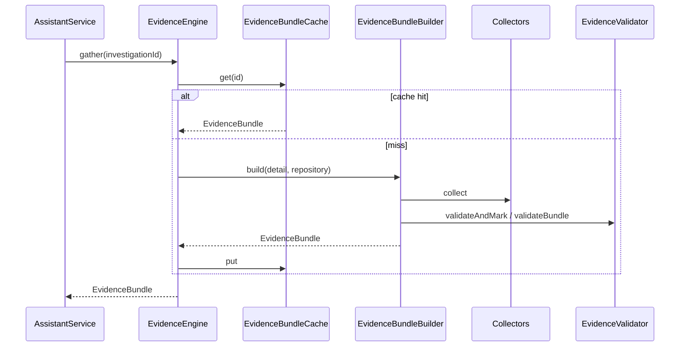

# Evidence Engine

## Purpose

Phase **3.5** introduced the Evidence Engine as the single source of truth for intelligent features.

Phase **4** Assistant consumes it exclusively via `EvidenceEngine` (dependency injection). There is **no** public Evidence HTTP API.

The engine performs **no AI reasoning**. It aggregates deterministic investigation outputs into immutable `EvidenceBundle` instances.

## Architecture position

```text
Repository Intelligence → Investigation Engine → Evidence Engine → Assistant → Frontend
```

## Package

`com.gitdetective.evidence`

| Area | Responsibility |
|------|----------------|
| `EvidenceEngine` | Facade: `gather`, `gatherFresh`, `prepareForAi`, `invalidate` |
| `service` | Orchestration + COMPLETED checks |
| `builder` | Assembles bundles via collectors |
| `collector` | Single-responsibility extractors |
| `mapper` | Investigation DTO → evidence abstraction |
| `validator` | Duplicate / mismatch / confidence checks |
| `cache` | In-memory cache (`EvidenceBundleCache`) |
| `model` | `EvidenceBundle`, `EvidenceRecord`, provenance, confidence |
| `controller` | Empty by design |

## Evidence flow



## Bundle structure

An `EvidenceBundle` includes repository information, investigation target, timeline, ownership, impact, relationships, dependencies, package health, hotspots, statistics, supporting refs (commits/files/packages/classes/methods/contributors), metadata, factual evidence summary, and `allEvidence`.

## Evidence record

Every `EvidenceRecord` includes: evidence ID, category, provenance source, source identifier, repository ID, investigation ID, timestamp, confidence, description, supporting metadata, verification status.

Anonymous evidence is forbidden.

## Confidence rules (deterministic)

| Confidence | Provenance class | Examples |
|------------|------------------|----------|
| 100% | Direct Git history | `GIT_COMMIT`, `TIMELINE_ENGINE`, `OWNERSHIP_ENGINE`, `FILE_HISTORY_ENGINE` |
| 100% | Static parser / workspace | `JAVA_PARSER`, `WORKSPACE_SCAN` |
| 100% | Repository metadata | `REPOSITORY_METADATA`, `INVESTIGATION_TARGET`, `STATISTICS_COLLECTOR`, `INVESTIGATION_EVIDENCE` |
| 95% | Graph / derived engines | `DEPENDENCY_GRAPH`, `RELATIONSHIP_ENGINE`, `IMPACT_ENGINE`, `PACKAGE_HEALTH_ENGINE`, `HOTSPOT_DETECTOR`, trace/cluster engines |

Implemented in `EvidenceConfidenceRules`.

## Collectors

`RepositoryMetadataCollector`, `InvestigationEvidenceCollector`, `TimelineCollector`, `OwnershipCollector`, `ImpactCollector`, `RelationshipCollector`, `DependencyCollector`, `HotspotCollector`, `PackageHealthCollector`, `StatisticsCollector`, `TraceCollector`, `CommitClusterCollector`

## Caching

- Interface: `EvidenceBundleCache` (Redis-ready)
- Default: `InMemoryEvidenceBundleCache`
- `gather` uses cache; `gatherFresh` bypasses; `invalidate` drops entries

## Internal API

```java
EvidenceBundle bundle = evidenceEngine.gather(investigationId);
EvidenceBundleView view = evidenceEngine.prepareForAi(investigationId);
```

## Future note

Additional AI features must continue to consume Evidence Bundles only. Do not query Git, parsers, or investigation engines from AI code paths.

---

**Made with ❤️ by Shivansh Bagga**
