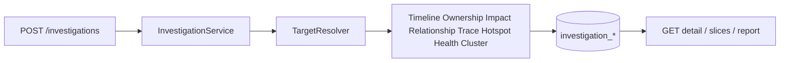

# Investigation Engine

## Purpose

Phase **3** introduced the Investigation Engine: deterministic engineering analysis over the Repository Intelligence knowledge base.

It does **not** use AI. It does **not** re-clone the repository for reads. All inputs come from indexed PostgreSQL metadata produced by Phase 2.

## Architecture position

```text
Repository Intelligence → Investigation Engine → Evidence Engine → Assistant → UI
```

## Package layout

| Package | Responsibility |
|---------|----------------|
| `investigation` | Orchestration, target resolution, report export, response assembly |
| `timeline` | Chronological events |
| `ownership` | Contributor ownership + bus factor |
| `impact` | Blast radius / depth / score |
| `relationship` | Structural relationships for graph views |
| `history` | File / commit history helpers |
| `trace` | Request / dependency-style traces |
| `investigation` engines | Hotspots, package health, commit clustering |

## Create flow

1. Client calls `POST /investigations` with `repositoryId`, `targetType`, `targetRef`
2. Repository must be `AnalysisStatus.COMPLETED` (otherwise `409 REPOSITORY_NOT_READY`)
3. `InvestigationTargetResolver` resolves the target against indexed entities
4. Engines compute slices and persist under `investigation_*` tables
5. Clients fetch full detail or slice endpoints / report export



## Target types

`CLASS` | `METHOD` | `PACKAGE` | `COMMIT` | `FILE` | `CONTRIBUTOR` | `BRANCH` | `TAG`

## Engine highlights

### Ownership / bus factor

Ownership is derived from commit and file-change evidence for the investigation target.

Bus factor uses the fewest contributors whose combined ownership reaches **≥ 50%**:

| Contributors needed | Level |
|---------------------|-------|
| 1 | HIGH risk |
| 2 | MEDIUM |
| 3+ | LOW |

### Impact

Blast radius walks dependency edges from the target.

Score (capped at 100):

```text
min(100, affectedClasses * 2 + affectedPackages * 3 + maxDepth * 5)
```

### Timeline

Chronological events from commits and related history for the target.

### Relationships

Structural edges suitable for React Flow visualization (imports, inheritance, implementation, and related investigation links).

### Hotspots, package health, clustering, traces

Additional deterministic slices persisted with the investigation and later collected by the Evidence Engine.

## HTTP surface

| Method | Path |
|--------|------|
| `POST` | `/investigations` |
| `GET` | `/investigations` |
| `GET` | `/investigations/{id}` |
| `GET` | `/investigations/{id}/timeline` |
| `GET` | `/investigations/{id}/ownership` |
| `GET` | `/investigations/{id}/impact` |
| `GET` | `/investigations/{id}/relationships` |
| `GET` | `/investigations/{id}/report?format=json\|markdown\|html` |

## Persistence (Flyway V2)

`investigations`, `investigation_evidence`, `investigation_timeline_events`, `investigation_relationships`, `investigation_ownership`, `investigation_impact_items`, `investigation_hotspots`, `investigation_package_health`, `investigation_commit_clusters`, `investigation_traces`

## Explicit non-goals

- No LLM calls inside investigation engines
- No mutation of analyzed repositories
- No speculative “likely causes” without indexed evidence

See [EVIDENCE_ENGINE.md](EVIDENCE_ENGINE.md) for how investigation outputs become AI-ready bundles.

---

**Made with ❤️ by Shivansh Bagga**
