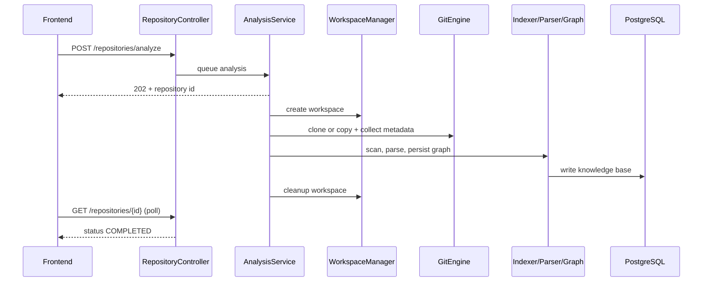
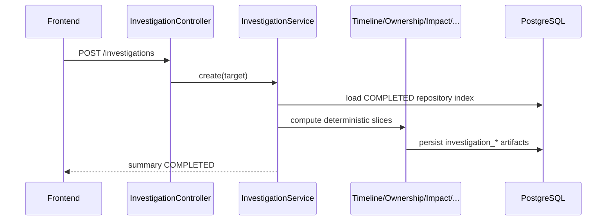
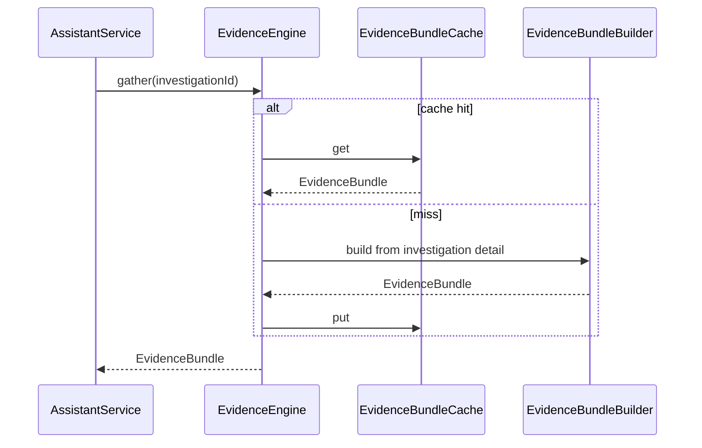
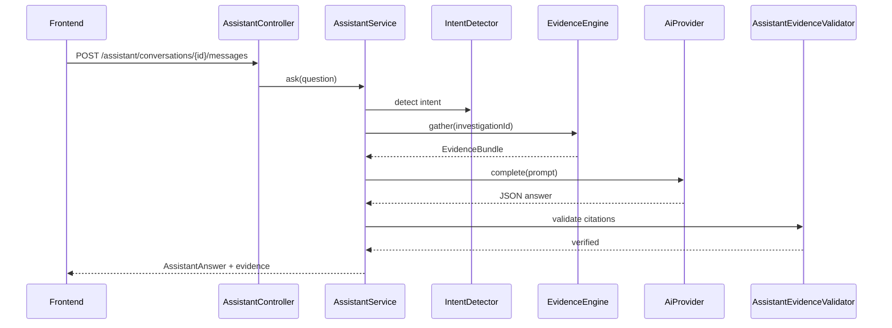
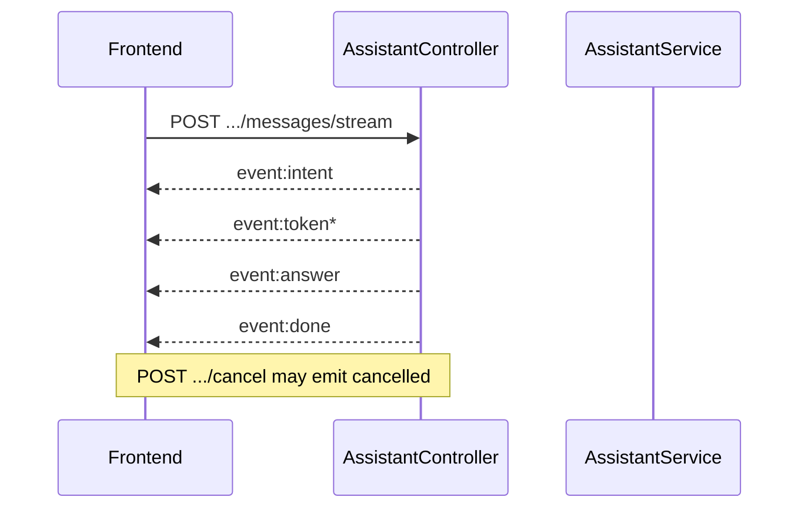

# Sequence Diagrams

Request lifecycles for Git Detective **v1.0.0**.

## Repository analysis

Progress states: `QUEUED → CLONING → SCANNING → PARSING → INDEXING → COMPLETED | FAILED`

## Investigation

## Evidence gather (internal)

## Evidence-backed assistant (blocking)

## Streaming ask (SSE)

## Correlation & rate limit (cross-cutting)

Every request receives `X-Correlation-Id`. Expensive POSTs (`/repositories/analyze`, `/investigations*`, `/assistant/*`) may return `429` with `Retry-After`.

---

**Made with ❤️ by Shivansh Bagga**
