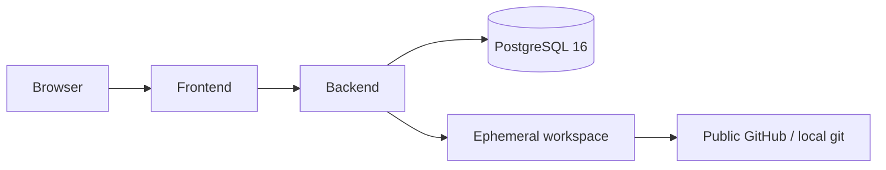

# System Architecture

Git Detective **v1.0.0** is a monorepo investigation platform. Facts are computed first. AI explains only after evidence is packaged and validated.

```text
┌─────────────────────────────────────────────────────────────┐
│ Frontend (Next.js App Router, React Query, React Flow)      │
│ Landing · Repositories · Investigations · Assistant         │
└────────────────────────────┬────────────────────────────────┘
                             │ HTTPS / JSON / SSE
┌────────────────────────────▼────────────────────────────────┐
│ Backend (Spring Boot 3.4 / Java 21)                         │
│ Controllers → Services → Engines                            │
│ Security headers · Rate limit · Correlation IDs             │
└───┬──────────────┬──────────────────┬───────────────────────┘
    │              │                  │
    ▼              ▼                  ▼
 Repository     Investigation      Assistant
 Intelligence   Engine             (Evidence only)
    │              │                  │
    └──────┬───────┘                  │
           ▼                          │
     Knowledge Graph / Postgres       │
           │                          │
           ▼                          │
     Evidence Engine ◄────────────────┘
```

## Bounded contexts

| Context | Package root | Responsibility |
|---------|--------------|----------------|
| Repository Intelligence | `analyzer`, `git`, `workspace`, `indexer`, `parser`, `graph` | Ingest & index repositories |
| Investigation | `investigation`, `timeline`, `ownership`, `impact`, `relationship`, `history`, `trace` | Deterministic engineering analysis |
| Evidence | `evidence` | Immutable AI-ready evidence bundles |
| Assistant | `assistant` | Intent, prompt, provider, validation, chat memory |
| Cross-cutting | `security`, `logging`, `config`, `exception`, `controller` | Platform & HTTP |

## Non-negotiable rules

1. The Assistant consumes **only** `EvidenceEngine` for investigative facts.
2. Investigations reuse the indexed knowledge base — they do not re-clone for reads.
3. AI may summarize and explain; it must not invent missing repository information.
4. The product never writes to analyzed repositories.

## Deployment topology



Local: Docker Compose (`postgres`, `backend`, `frontend`) or Postgres via `scripts/dev-up.sh` plus local Maven/npm processes.  
Cloud: Zerops services `backend` and `frontend` (`zerops.yml`); Postgres is provisioned separately.

See also [ARCHITECTURE.md](ARCHITECTURE.md), [COMPONENT_DIAGRAM.md](COMPONENT_DIAGRAM.md), [SEQUENCE_DIAGRAMS.md](SEQUENCE_DIAGRAMS.md).

---

**Made with ❤️ by Shivansh Bagga**
